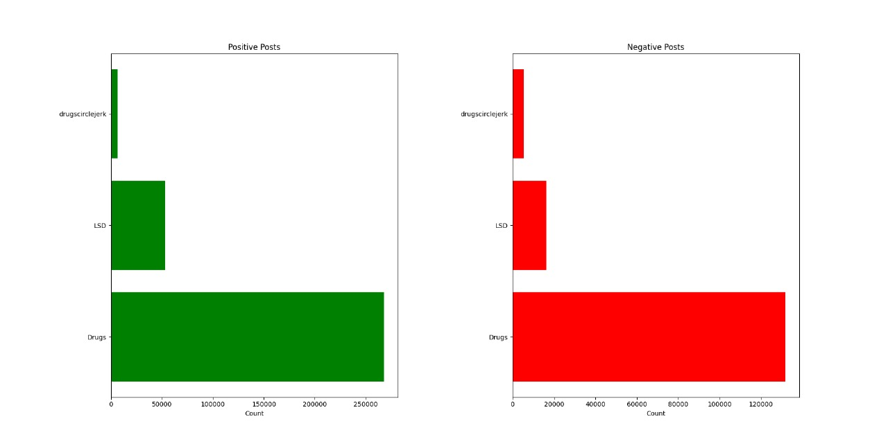

**[Analyzing Drug-related Posts and Discussions on Reddit]{.underline}**

**[We are using these libraries:]{.underline}**

Sentiment Analysis using the Vader sentimentIntensity Analyzer.

In this we use NLTK library to assign sentiment scores to each post and
then classify them based on these scores

i.  POSITIVE

ii. NEGATIVE

iii. NETURAL

-   **[Trend Analysis]{.underline}**:

It is used to give reviews of current methods within an organisation and
can pinpoint any trend that happened on social media.

-   **[Comparison across sub-reddits]{.underline}**:-

We are comparing above mentioned subreddits like which have more
enganing audience and which have high posts and how posts are getting
trending.

-   **[Some Analysis are]{.underline}**:-

i.  Network Analysis:- It involves the studing and interpreting
    > relationships between entities such as nodes and interactions that
    > link them together.

ii\. Time Series analysis:-Time series analysis is a vital statistical
technique used to understand and analyze- data points collected over
successive intervals of time.

iii\. Text classification :-The process is essential for automating the
org and analysis of large volumes of textual data. Text application in
various field including sentiment analysis, spam detection, topic
categorization etc.

iv\. Active Users Over Time:- This process is used in monitoring and
analyzing the number of active users over time is a crucial aspect of
assessing the health and success of digital platforms ,etc.

v\. NLP :- The aim of NLP to bridge the gap between human communication
and machine facilitating interactions between humans and computers using
natural language.

-   We are using PYCHARM to run our all program

-   -We have created data by our self in format of .ndJSON
